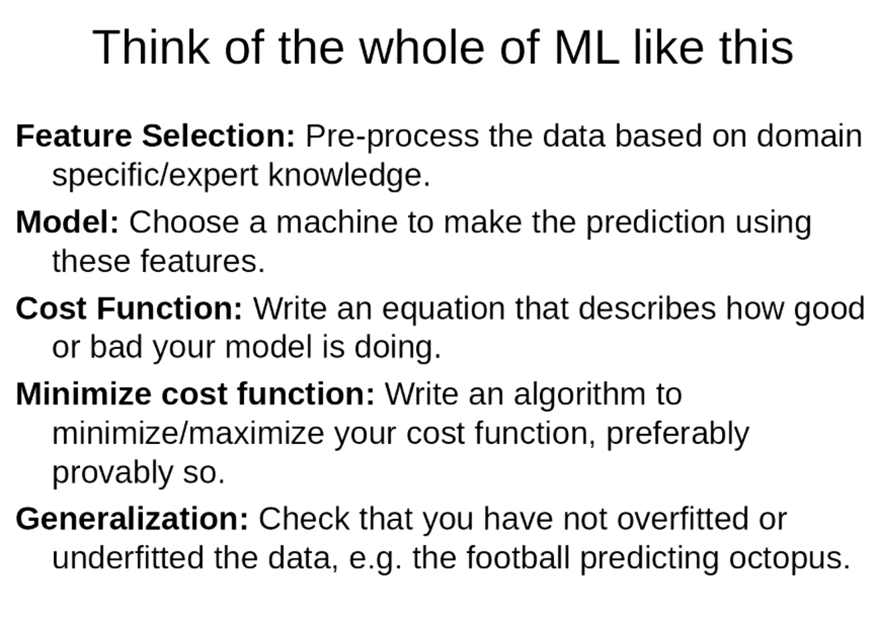
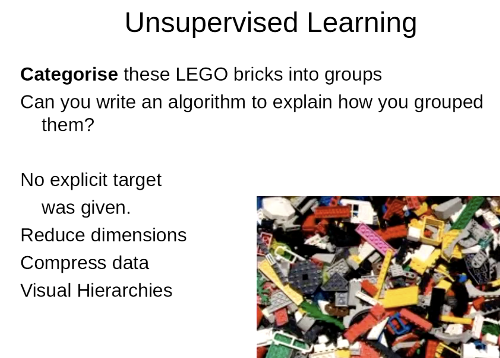
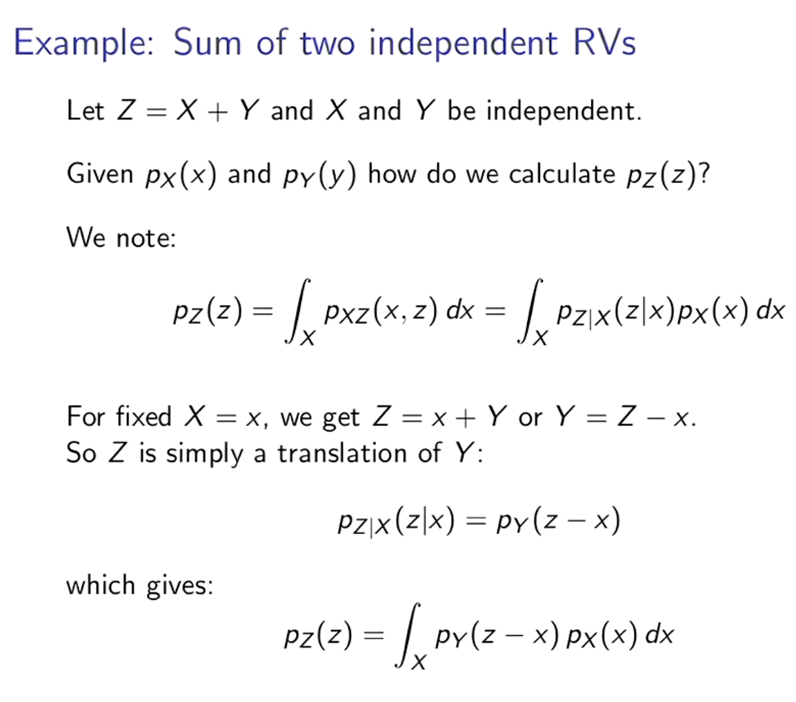

# machine-learning

Recommended text
1. [Machine Learning A Probabilistic Perspective](https://www.cs.ubc.ca/~murphyk/MLbook/pml-toc-1may12.pdf)
Kevin P. Murphy

2. [Bayesian Reasoning and Machine Learning](http://web4.cs.ucl.ac.uk/staff/D.Barber/textbook/091117.pdf)

3. [Pattern Classification](https://www.researchgate.net/publication/228058014_Pattern_Classification)

4. 

Description| Notes | Images
---|---|---
Whole of Machine Learning| | 
Types of ML learning methods| |
Unsupervised Learning| |
Sum of 2 Random Variables| |
